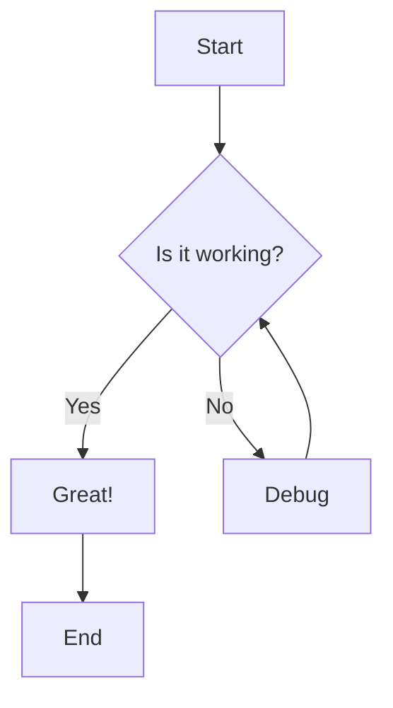

## Table of Contents

- [Markdown Style Rules](#markdown-style-rules)
- [Markdown Formatting Rules](#markdown-formatting-rules)
- [Extended Markdown Features](#extended-markdown-features)
- [Accessibility Guidelines](#accessibility-guidelines)
- [SEO Optimization](#seo-optimization)
- [Documentation Best Practices](#documentation-best-practices)
- [Tools and Automation](#tools-and-automation)
- [Advanced Techniques](#advanced-techniques)

### Markdown Style Rules

#### Heading

Header text must use the `atx-style` with no closing `#` character.

```
# Heading 1

## Heading 2
```

Headings with `=` or `-` underlines can be annoying to maintain and don’t fit with the rest of the heading syntax.

```markdown
# Wrong

## Heading

# Right

# Heading

## Heading
```

To distinguish between paragraphs and headers, it is recommended to wrap up and down with at least one blank line.

```
# Wrong
Paragraph

# Heading

Paragraph

# Right
Paragraph
# Heading
Paragraph
```

#### Horizontal Rules

The rule for horizontal rules in this style guide is to use hyphens (instead of asterisks or underscores).

```
--------------------------------------------------------------------------
```

#### Paragraph

Recommended not to use spaces or tabs before paragraphs because they can cause unexpected formatting problems.

```markdown
# Wrong

This is the Pelagornis Company.

We offer steady products.

# Right

This is the Pelagornis Company.

We offer steady products.
```

Using a line break (`<br>`) that does not change paragraphs will represent two spaces.

#### Emphasis

When using `Bold`, some markdown applications do not support the use of `_`(underscores) in the middle of words.
For compatibility, we recommend wrapping it in two `*` (asterisks).

```
# Wrong
Hello __World__

# Right
Hello **World**
```

When using `Italic`, For compatibility, we recommend wrapping it in one `*` (asterisks).

```
# Wrong
Hello _World_

# Right
Hello *World*
```

Link emphasis is recommended to wrap around the entire link grammar.

```
Pelagornis Design: **[pelagornis design](https://design.pelagornis.com)**
```

#### List

Unordered list Items should use `-` instead of `*`.

```
- list item 1
- list item 2
    - sub-list item
```

All lists must be followed by newlines.

```
- list item 1
- list item 2
    1. sub-list item 1
    2. sub-list item 2

    - sub list item 3
    - sub list item 4
```

#### Code

Inline code must use single backticks and must not have spaces between the backtick characters and the code.

```
# Wrong
` code `

# Right
`code`
```

#### BlockQuote

Separate using one space between `>` and content

```
# Wrong
>Content
>  Content

# Right
> Content
```

#### Table

For readability, pipe characters must have spaces before and after, and the column width of the table must be determined by the longest cell in the column.
Always formalize the table so that it can be read from preprocessing.

```
# Wrong
table header | other table header
--- | ---
table data | other table data

# Right
table header | other table header
------------ | ------------------
table data   | other table data
```

Do not use pipes before and after when creating tables.

```
| table header | other table header |
| ------------ | ------------------ |
| table data   | table data         |
```

### Markdown Formatting Rules

#### Maximum line length

Each line should have a maximum column width of 80 characters.

#### List Format

`List items` must be indented 4 spaces further than their parent.

The first level of list items must not be preceded by a newline.

#### Table Format

Tables must always be preceded and followed by newlines.

### Extended Markdown Features

#### Task Lists

Use task lists for tracking progress and todos.

```markdown
## Project Tasks

- [x] Design system architecture
- [x] Implement core features
- [ ] Write documentation
- [ ] Add unit tests
- [ ] Deploy to production
```

#### Definition Lists

Use definition lists for glossaries and term explanations.

```markdown
API
: Application Programming Interface - a set of protocols and tools for building software applications

SDK
: Software Development Kit - a collection of software development tools in one installable package

CI/CD
: Continuous Integration/Continuous Deployment - automated software development practices
```

#### Footnotes

Use footnotes for additional information and citations.

```markdown
This is a statement that needs clarification[^1].

[^1]: This is the footnote content that provides additional context.
```

#### Strikethrough

Use strikethrough for deprecated or outdated information.

```markdown
~~This feature is deprecated~~ This feature has been replaced with a new implementation.
```

#### Highlighting

Use highlighting for important information (GitHub Flavored Markdown).

```markdown
This is ==highlighted text== that draws attention to important information.
```

### Accessibility Guidelines

#### Alt Text for Images

Always provide meaningful alt text for images to improve accessibility.

```markdown
# Wrong


# Right


```

#### Descriptive Link Text

Use descriptive link text instead of generic phrases.

```markdown
# Wrong

Click [here](https://example.com) for more information.

# Right

Read our [comprehensive documentation](https://example.com) for more information.
```

#### Heading Structure

Maintain proper heading hierarchy for screen readers.

```markdown
# Main Title (H1)

## Section Title (H2)

### Subsection Title (H3)

#### Detail Title (H4)
```

#### Table Headers

Always include table headers for better accessibility.

```markdown
| Feature | Status | Notes       |
| ------- | ------ | ----------- |
| Login   | ✅     | Complete    |
| Signup  | 🚧     | In progress |
```

### SEO Optimization

#### Meta Descriptions

Include meta descriptions in your document front matter.

```yaml
---
title: "Complete Guide to Markdown"
description: "Learn markdown syntax, best practices, and advanced techniques for better documentation"
keywords: ["markdown", "documentation", "writing", "syntax"]
author: "Your Name"
date: "2024-01-15"
---
```

#### Structured Headings

Use descriptive headings that include relevant keywords.

```markdown
# Wrong

# Chapter 1

## Section A

# Right

# Getting Started with Markdown

## Basic Syntax and Formatting
```

#### Internal Linking

Use internal links to connect related content.

```markdown
For more information about [advanced formatting](advanced-techniques.md), see our comprehensive guide.

Related topics:

- [Accessibility Guidelines](#accessibility-guidelines)
- [SEO Best Practices](#seo-optimization)
```

### Documentation Best Practices

#### Document Structure

Follow a consistent document structure for better readability.

```markdown
# Document Title

Brief description of what this document covers.

## Table of Contents

- [Overview](#overview)
- [Prerequisites](#prerequisites)
- [Installation](#installation)
- [Usage](#usage)
- [Examples](#examples)
- [Troubleshooting](#troubleshooting)

## Overview

## Prerequisites

## Installation

## Usage

## Examples

## Troubleshooting
```

#### Code Examples

Provide clear, executable code examples with explanations.

````markdown
## Creating a Simple Function

Here's how to create a basic function in JavaScript:

```javascript
function greetUser(name) {
  return `Hello, ${name}! Welcome to our application.`;
}

// Usage
const message = greetUser("Alice");
console.log(message); // Output: Hello, Alice! Welcome to our application.
```
````

**Explanation**: This function takes a name parameter and returns a personalized greeting message.

````

#### Version Information
Include version information for API documentation.

```markdown
## API Endpoints

> **Version**: v2.1.0
> **Base URL**: `https://api.example.com/v2`
> **Last Updated**: 2024-01-15

### GET /users

Retrieve a list of users.

**Parameters:**
- `limit` (optional): Number of users to return (default: 10, max: 100)
- `offset` (optional): Number of users to skip (default: 0)
````

### Tools and Automation

#### Linting

Use markdown linters to maintain consistency.

```json
// .markdownlint.json
{
  "MD013": { "line_length": 100 },
  "MD024": { "siblings_only": true },
  "MD029": { "style": "ordered" },
  "MD033": false
}
```

#### Pre-commit Hooks

Set up pre-commit hooks for automatic formatting.

```yaml
# .pre-commit-config.yaml
repos:
  - repo: https://github.com/igorshubovych/markdownlint-cli
    rev: v0.37.0
    hooks:
      - id: markdownlint
        args: [--fix]
```

#### Documentation Generation

Use tools to generate documentation from markdown.

```bash
# Using MkDocs
mkdocs build

# Using GitBook
gitbook build

# Using Docusaurus
npm run build
```

### Advanced Techniques

#### Mermaid Diagrams

Include diagrams using Mermaid syntax.

````markdown

````

````

#### Mathematical Expressions
Use LaTeX syntax for mathematical expressions.

```markdown
Inline math: $E = mc^2$

Block math:
$$
\int_{-\infty}^{\infty} e^{-x^2} dx = \sqrt{\pi}
$$
````

#### Custom HTML

Use HTML for advanced formatting when needed.

```markdown
<div class="warning">
  <strong>Warning:</strong> This feature is experimental and may change in future versions.
</div>

<details>
<summary>Click to expand</summary>

This content is hidden by default and can be expanded by clicking the summary.

</details>
```

#### Embedding Content

Embed external content when appropriate.

```markdown
<!-- YouTube Video -->
<iframe width="560" height="315" src="https://www.youtube.com/embed/VIDEO_ID" frameborder="0" allowfullscreen></iframe>

<!-- CodePen -->
<iframe height="300" style="width: 100%;" scrolling="no" title="Example" src="https://codepen.io/username/embed/example" frameborder="no" allowtransparency="true" allowfullscreen="true"></iframe>
```
